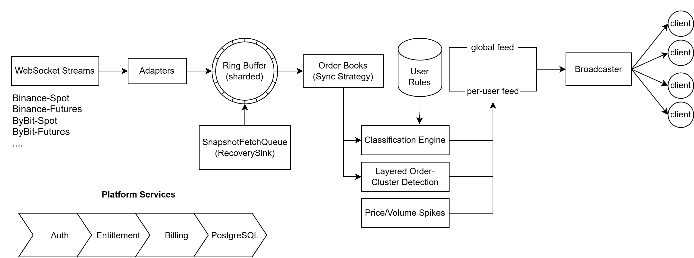

# TC Screener — Backend

Backend for **[TC Screener](https://tc-screener.com)**, a real-time cryptocurrency order-book screener.
It keeps live local order books for every tracked instrument across several exchanges, finds the
large price levels that matter, and pushes a classified feed to each user over WebSocket.

It also handles accounts, subscriptions and payments.

The frontend lives in [`screener-frontend-v2`](https://github.com/AbuShl123/screener-frontend-v2).

---

## Features

- **Multi-exchange market data:** Binance spot, Binance futures, MEXC spot and MEXC futures. This is
  1000+ concurrent depth streams and hundreds of thousands of diff messages per second.
- **Accurate local order books:** each book is synced from a REST snapshot plus a streamed diff
  sequence and checked by a per-venue sync strategy. Any gap triggers automatic recovery.
- **Order classification:** price levels are ranked into tiers by notional size, distance from
  mid-price and lifetime. Users can layer their own rules on top of the global defaults, and a rule
  edit reaches the live feed without a reconnect.
- **Live delivery:** a JWT-gated WebSocket feed with a full snapshot on connect, then incremental
  `ADD` / `UPDATE` / `DROP` messages every 100 ms.
- **Accounts:** registration, email verification, login, refresh tokens and `USER` / `ADMIN` roles.
- **Monetization:** a plan catalog with fixed day bundles and pay-per-day pricing, a free trial,
  an order/payment flow through the [Multicard](https://multicard.uz) gateway, and an append-only
  entitlement ledger.
- **Admin tools:** catalog management, user usage, manual access grants, connection presence and
  order-book diagnostics.

## Architecture

Everything runs in one JVM: a Spring Boot MVC application on Tomcat, backed by PostgreSQL.



**The market-data pipeline:**

1. Each venue (an exchange plus a market) has a pool of WebSocket connections.
2. Incoming depth diffs are parsed in place and published to sharded LMAX Disruptor ring buffers.
   An instrument always maps to the same shard, so each order book is owned by exactly one thread.
3. Each book moves through `PENDING → RECOVERING → SYNCED`. A REST snapshot is fetched within the
   venue's rate limits, and buffered diffs are replayed on top of it.
4. Synced books are classified, and the 100 ms broadcaster pushes the changes to connected clients.

The pipeline is the hot path. It allocates nothing per message, uses primitive `double` prices and
Jackson streaming parsing, and never synchronizes the books. The rest of the codebase is ordinary
Spring MVC + JPA code.

Adding an exchange means writing an adapter against the SPI in `marketdata/spi/`. The adapter
supplies instrument discovery, the stream protocol, snapshot fetching and the sync strategy. The
core pipeline does not change.

## Tech stack

| Area | Technology |
|------|------------|
| Language / runtime | Java 21 (virtual threads for WebSocket send loops) |
| Framework | Spring Boot 4 — Web MVC (Tomcat), Security, Data JPA, Mail, Thymeleaf |
| Database | PostgreSQL + Flyway migrations |
| Market-data ingress | LMAX Disruptor 4, Java-WebSocket client, Jackson streaming, FastDoubleParser |
| Outbound HTTP | Spring `WebClient` (WebFlux is used as a client library only) |
| Auth | JWT access tokens (Nimbus JOSE) + DB-backed refresh tokens |
| Build | Maven (wrapper included) |

## Getting started

### Prerequisites

- JDK 21
- PostgreSQL 15+
- An SMTP account for verification emails, if you want to test registration end to end

### 1. Create the database

```sql
CREATE USER screener_user WITH PASSWORD 'change-me';
CREATE DATABASE screener_db OWNER screener_user;
GRANT ALL ON SCHEMA public TO screener_user;
```

Flyway creates every table on first startup. You don't need any manual DDL.

### 2. Configure the environment

All secrets and connection details come from environment variables. `application.yml` holds safe
defaults for everything else.

| Variable | Purpose |
|----------|---------|
| `DB_URL` | JDBC URL, e.g. `jdbc:postgresql://localhost:5432/screener_db` |
| `DB_USER` / `DB_PASSWORD` | Database credentials |
| `SPRING_FLYWAY_ENABLED` | `true` to run migrations on startup |
| `SPRING_JPA_HIBERNATE_DDL_AUTO` | `validate` (recommended) |
| `JWT_SECRET` | Base64 256-bit signing key — `openssl rand -base64 32` |
| `MAIL_HOST`, `MAIL_PORT`, `MAIL_USERNAME`, `MAIL_PASSWORD`, `MAIL_FROM` | SMTP for transactional email |
| `EMAIL_VERIFY_PAGE_URL` | Frontend page that the verification link opens |
| `SCREENER_ADMIN_EMAILS` | Comma-separated emails promoted to `ADMIN` on startup |
| `MULTICARD_APP_ID`, `MULTICARD_SECRET`, `MULTICARD_STORE_ID` | Payment gateway credentials |
| `MULTICARD_CALLBACK_URL`, `MULTICARD_RETURN_URL` | Public callback endpoint and the post-payment landing page |
| `MULTICARD_OFD_ENABLED` | Fiscalization toggle (defaults to `true`) |
| `BINANCE_ENABLED`, `MEXC_ENABLED` | Turn an exchange's market data on or off (both default to `true`) |

For local development you can put overrides in `src/main/resources/application-local.yml`. This
file is gitignored. Activate it with the `local` profile.

### 3. Build and run

```bash
./mvnw spring-boot:run                                          # uses environment variables
./mvnw spring-boot:run -Dspring-boot.run.profiles=local         # uses application-local.yml

./mvnw clean package -DskipTests                                # → target/screener.jar
java -jar target/screener.jar
```

The server listens on port `8080`. Market-data streams start once the first instrument-universe
refresh completes.

### 4. Run the tests

```bash
./mvnw test                                          # all tests
./mvnw test -Dtest=OrderServiceTest                  # a single class
./mvnw test -Dtest=OrderServiceTest#methodName       # a single method
```

Most tests are plain unit tests. `ScreenerBackendApplicationTests` boots the full context, so it
needs a reachable database.

## API overview

All REST errors share one JSON shape (`ApiError`). Endpoints need a valid JWT
(`Authorization: Bearer <token>`) unless they are marked public.

| Path | Access | Purpose |
|------|--------|---------|
| `/api/auth/register`, `login`, `refresh`, `verify-email`, `resend-verification` | public | Account lifecycle |
| `/api/auth/logout`, `/api/auth/me` | user | Session and profile |
| `/api/billing-catalog/**` | public | Plans and prices |
| `/api/billing/entitlement`, `/api/billing/orders/**` | user | Access state, history, purchases |
| `/api/payment/multicard/callback` | gateway | Payment confirmation (IP-restricted, signed) |
| `/api/rules/**` | user + active access | Per-user classification rules |
| `/api/tickers` | user | Tracked instruments |
| `/ws` | user + active access (token on connect) | Live classified order-book feed |
| `/api/admin/**` | admin | Billing catalog, user usage, access grants |
| `/api/monitoring/**` | admin | Presence and order-book diagnostics |

Full request/response contracts are in [`.claude/docs/for-frontend/`](.claude/docs/for-frontend).

## Project layout

```
src/main/java/dev/abu/screener_backend/
├── marketdata/      # identity, instrument universe, and the pipeline
│   ├── spi/         #   adapter contracts (discovery, stream protocol, snapshots, sync)
│   ├── core/        #   venue-agnostic stream / ingress / book / recovery / health
│   └── adapter/     #   binance/, mexc/
├── analysis/        # order classifier + per-user rules (rule/)
├── feed/            # broadcaster and global / per-user feed stores
├── ws/              # WebSocket server endpoint
├── auth/  user/     # authentication, JWT, users and roles
├── email/           # transactional email (Thymeleaf templates)
├── billing/         # plan catalog and pricing
├── entitlement/     # access source of truth + ledger
├── payment/         # orders, state machine, reconciliation, multicard/
├── monitoring/      # admin diagnostics
├── config/          # @ConfigurationProperties records, security, web clients
└── error/           # ApiException + global handler

src/main/resources/
├── application.yml  # all tunables under screener.*
├── db/migration/    # Flyway migrations (V<n>__description.sql)
└── templates/email/ # HTML email templates
```

## Configuration

Every tunable lives in `application.yml` under `screener.*` and is bound to a typed
`@ConfigurationProperties` record. The main groups:

- `screener.exchanges.<exchange>.venues.<market>.*`: stream and REST URLs, topics, connection
  caps, heartbeats, and snapshot depth and rate limits for each venue.
- `screener.discovery`: universe refresh timeouts and symbols excluded everywhere (stablecoins,
  metals).
- `screener.disruptor`: shard count (must be a power of two) and ring-buffer size.
- `screener.orderbook.price-filter-threshold`: how far from mid-price levels are kept.
- `screener.billing`, `screener.payment`, `screener.jwt`, `screener.email`: business settings
  (trial length, renewal window, token lifetimes and so on).

Schema changes go only through new Flyway migrations. Never edit a migration that has already been
applied.

## Deployment

Production runs as a single fat JAR under systemd on an Ubuntu VPS. Nginx sits in front of it,
terminates TLS (Let's Encrypt), serves the frontend, and proxies `/api` and `/ws` to the app on
port 8080. PostgreSQL runs on the same host and is reachable only locally. Secrets are kept in an
environment file that systemd loads.

A deploy is: build `target/screener.jar`, back up the current JAR, upload the new one, and restart
the service.

## Documentation

Detailed design notes live in [`.claude/docs/`](.claude/docs):

- [`multi-exchange-progress.md`](.claude/docs/multi-exchange-progress.md): pipeline architecture, the sync contract, each adapter, known gaps
- [`orderbook-classification.md`](.claude/docs/orderbook-classification.md): how levels are tiered and ranked
- [`websocket-server.md`](.claude/docs/websocket-server.md): the delivery layer
- [`payment-gateway-multicard.md`](.claude/docs/payment-gateway-multicard.md): payment integration
- [`pipeline-benchmark-2026-09-08.md`](.claude/docs/pipeline-benchmark-2026-09-08.md): measured throughput and memory baseline
- [`epics.md`](.claude/docs/epics.md): how the roadmap is organized

Contributor and agent guidance is in [`CLAUDE.md`](CLAUDE.md).

## Roadmap

- Price/volume spike alerts and order-cluster signals
- Klines and trade streams
- More exchanges
- Historical order-book recording
- Additional payment providers
